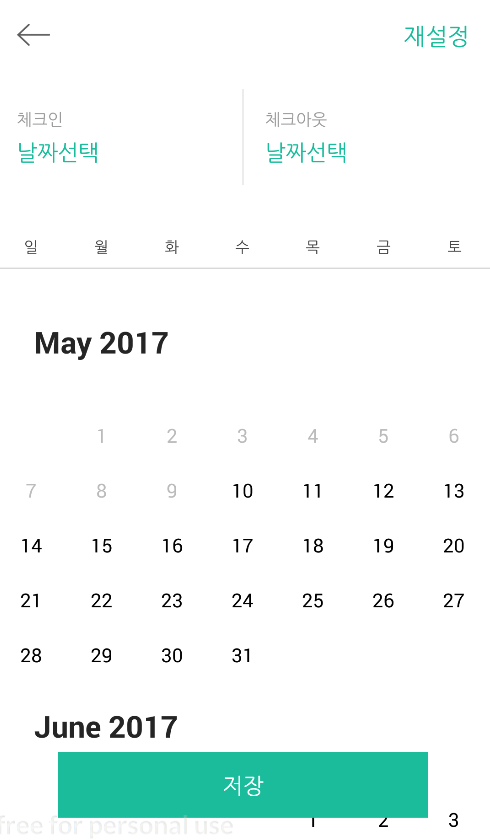
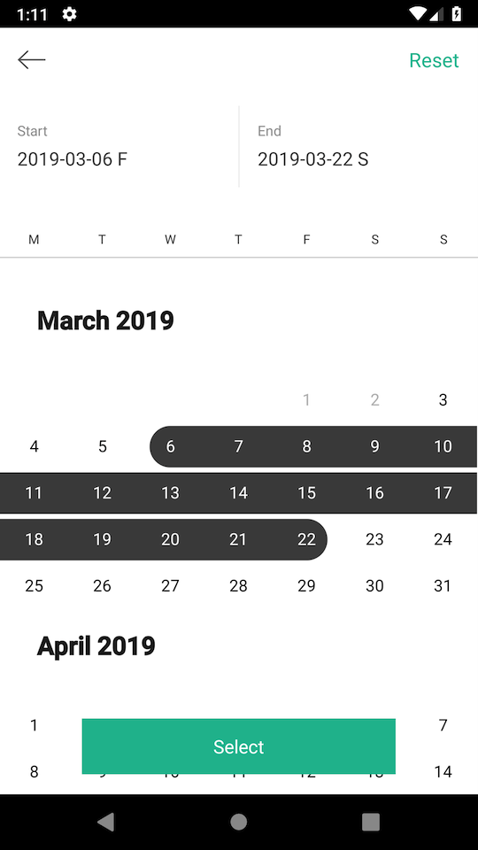
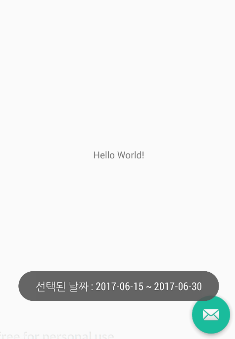

## [Korean]
[View](http://mytalkhome.tistory.com/881)

## [English]
# AirCalendar
Airbnb-style calendar

[](https://jitpack.io/#yongbeam/AirCalendar)

# Example
<p align="center">
  
  
  
</p>


# Usage

1.Include the library as local library project.
```gradle
  allprojects {
		repositories {
			...
			maven { url 'https://jitpack.io' }
		}
	}
```

```gradle
  implementation 'com.github.yongbeam:AirCalendar:x.x.x'
```

2.Add AirCalendarDatePickerActivity into your AndroidManifest.xml
```xml
    <activity android:name="com.yongbeom.aircalendar.AirCalendarDatePickerActivity"
            android:theme="@style/Theme.AppCompat.NoActionBar" />
```


3.The AirCalendar configuration is created using the builder pattern.
```java
        AirCalendarIntent intent = new AirCalendarIntent(this);
        intent.isBooking(false);
        intent.isSelect(false);
        intent.setBookingDateArray('Array Dates( format: yyyy-MM-dd');
        intent.setStartDate(yyyy , MM , dd); // int
        intent.setEndDate(yyyy , MM , dd); // int
        intent.isMonthLabels(false);
        intent.setSelectButtonText("Select"); //the select button text
        intent.setResetBtnText("Reset"); //the reset button text
        intent.setWeekStart(Calendar.MONDAY);
        intent.setWeekDaysLanguage(AirCalendarIntent.Language.EN); //language for the weekdays
	
        ArrayList<String> weekDay = new ArrayList<>();
        weekDay.add("M");
        weekDay.add("T");
        weekDay.add("W");
        weekDay.add("T");
        weekDay.add("F");
        weekDay.add("S");
        weekDay.add("S");
        intent.setCustomWeekDays(weekDay); //custom weekdays
	
        startActivityForResult(intent, REQUEST_CODE);
```

4.Override onActivityResult method and handle AirCalendar result.
```java
    @Override
    protected void onActivityResult(int requestCode, int resultCode, Intent data) {
        super.onActivityResult(requestCode, resultCode, data);

        if (resultCode == RESULT_OK && requestCode == REQUEST_CODE) {
            if(data != null){
                Toast.makeText(this, "Select Date range : " + data.getStringExtra(AirCalendarDatePickerActivity.RESULT_SELECT_START_DATE) + " ~ " + data.getStringExtra(AirCalendarDatePickerActivity.RESULT_SELECT_END_DATE), Toast.LENGTH_SHORT).show();
            }
        }
    }
```


#### Option
```java
      intent.isBooking(false);      // DEFAULT false
      intent.isSelect(false);       // DEFAULT false
      intent.setBookingDateArray(); // DEFAULT NULL
      intent.setStartDate();        // DEFAULT NULL
      intent.setEndDate();          // DEFAULT NULL
      intent.isMonthLabels(false);  // DEFAULT false
      intent.setActiveMonth(3)      // DEFAULT max year
      intent.setMaxYear(2030)       // DEFAULT 2year
      intent.setStartYear(2016)     // DEFAULT Current year
```


#### Result Option
```java
    AirCalendarDatePickerActivity.RESULT_SELECT_START_DATE
    AirCalendarDatePickerActivity.RESULT_SELECT_END_DATE
    AirCalendarDatePickerActivity.RESULT_SELECT_START_VIEW_DATE // Day of the week
    AirCalendarDatePickerActivity.RESULT_SELECT_END_VIEW_DATE   // Day of the week
    AirCalendarDatePickerActivity.RESULT_FLAG
    AirCalendarDatePickerActivity.RESULT_TYPE
    AirCalendarDatePickerActivity.RESULT_STATE
```


### Customization ( by CalendarListview )

CalendarListview is fully customizable:

* app:colorCurrentDay [color def:#ff999999] --> The current day is always in bold but you can change its color
* app:colorSelectedDayBackground [color def:#E75F49] --> If you click on a day, a circle indicator or a rouded rectangle indicator will be draw.
* app:colorSelectedDayText [color def:#fff2f2f2] --> This is the text color of a selected day
* app:colorPreviousDay [color def:#ff999999] --> In the current month you can choose to have a specific color for the past days
* app:colorNormalDay [color def:#ff999999] --> Default text color for a day
* app:colorMonthName [color def:#ff999999] --> Month name and year text color
* app:colorDayName [color def:#ff999999] --> Day name text color
* app:textSizeDay [dimension def:16sp] --> Font size for numeric day
* app:textSizeMonth [dimension def:16sp] --> Font size for month name
* app:textSizeDayName [dimension def:10sp] --> Font size for day name
* app:headerMonthHeight [dimension def:50dip] --> Height of month name
* app:drawRoundRect [boolean def:false] --> Draw a rounded rectangle for selected days instead of a circle
* app:selectedDayRadius [dimension def:16dip] --> Set radius if you use default circle indicator
* app:calendarHeight [dimension def:270dip] --> Height of each month/row
* app:enablePreviousDay [boolean def:true] --> Enable past days in current month
* app:currentDaySelected [boolean def:false] --> Select current day by default
* app:firstMonth [enum def:-1] --> Start listview at the specified month
* app:lastMonth [enum def:-1] --> End listview at the specified month


### Customization2 
* [Sample Activity](https://github.com/yongbeam/AirCalendar/blob/master/AirCalendar/src/main/java/com/yongbeom/aircalendar/AirCalendarDatePickerActivity.java)


## Thanks
>* [CalendarListview](https://github.com/traex/CalendarListview)


## Contributions
>* [Adrian-Alexandru Coman](https://github.com/adriancoman)
>* [IMLUNCH](https://github.com/jhamin0511)


# License

Copyright © 2017 - 2019 copyright YongBeomLee

Permission is hereby granted, free of charge, to any person obtaining a copy of this software and associated documentation files (the “Software”), to deal in the Software without restriction, including without limitation the rights to use, copy, modify, merge, publish, distribute, sublicense, and/or sell copies of the Software, and to permit persons to whom the Software is furnished to do so, subject to the following conditions:

The above copyright notice and this permission notice shall be included in all copies or substantial portions of the Software.

THE SOFTWARE IS PROVIDED “AS IS”, WITHOUT WARRANTY OF ANY KIND, EXPRESS OR IMPLIED, INCLUDING BUT NOT LIMITED TO THE WARRANTIES OF MERCHANTABILITY, FITNESS FOR A PARTICULAR PURPOSE AND NONINFRINGEMENT. IN NO EVENT SHALL THE AUTHORS OR COPYRIGHT HOLDERS BE LIABLE FOR ANY CLAIM, DAMAGES OR OTHER LIABILITY, WHETHER IN AN ACTION OF CONTRACT, TORT OR OTHERWISE, ARISING FROM, OUT OF OR IN CONNECTION WITH THE SOFTWARE OR THE USE OR OTHER DEALINGS IN THE SOFTWARE.
